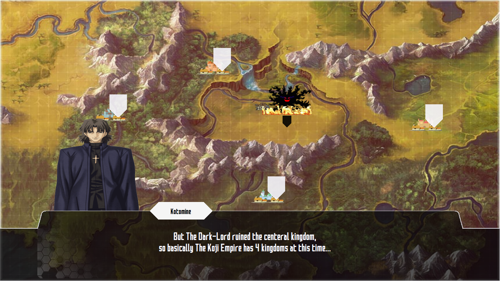

<!--
	Copyright (C) ALiwoto 2019 - 2020
	This file is subject to the terms and conditions defined in
	file 'LICENSE', which is part of the source code.
	Version 1.1.1.5500
-->

# <h1 align="middle">  SAO_Game 
> Name:		SAO					\
> Version:	v1.1.1.5500			\
> Edit:		October 2020		\
> By:		ALi.w (C) wotoTeam	

</h1>

              

Welcome to the SAO_Game source code! 

* WARNING: this version of SAO_Game is deprecated. We will no longer update it in the future. If you are interested in this project, please follow the new version from [here](https://github.com/TeaInside/SAO).

Sword Art Online Last Testament, is a open-source MMORPG game.
From this repository you cannot build this game, none of the game data are included (except for resources).

* If you are interested in working on this project, you can help us in:
  * Programming:
    * front-end: C#
	* back-end : Golang
	* databse : MongoDB

  * Graphics:
    * drawing arts (Anime-style)
	* drawing characters (Character designer)
	* drawing maps
	* editing pictures

  * Everything else you think will help us in this way  

### How to contact me?
you can reach out to me in [Telegram](https://t.me/Falling_inside_The_Black) messager.

### What's the true purpose of uploading a deprecated version of a game on GitHub's server?
Please notice that this version of SAO_Game is based on .NET Framework 4.7, and it's using Windows Forms.
In another words, it's not cross-platform and it can only be compile and executed on Windows platform.
But the newer version (V2.0) is cross-platform and based on MonoGame.
I decided to upload this old version on GitHub, so another programmers who are interested in using Windows Form, can use it and learn something new. I know my experiences are not that much, but at least by this work, these so called experiences won't be vain. At least this is what I think.
If you are here to read this code, be aware that I'll be happy if you use at least a bit of it in your project.
If you have any problems reading/understanding the code, you can just pm me in [Telegram](https://t.me/Falling_inside_The_Black), or in Discord.  

:camera: Screenshots from Game:

 
 
 
 
 
 
 
 
 
 
 
 
 
 
 
 
 

